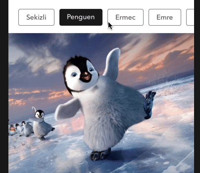

# react-native-scroll-menu

React native scrolling button horizontal

## Installation

npm i react-native-scroll-menu

yarn add react-native-scroll-menu

## Example

|                          Example                              |
| :-----------------------------------------------------------: |
|  | 
|  | 

## Usage

```JavaScript
import React, {Component} from 'react';
import {
    View
} from 'react-native';

//import this
import ScrollingMenu from 'react-native-scroll-menu';

//define menu
let menus = [
    {
        name: 'Sekiz',
        id: 1,
        backgroundColor: '#388E3C',
        borderColor: '#388E3C',
    },
    {
        text: 'Penguen',
        id: 2,
    }
];

export default class Example extends Component {


    render() {
        return (
            <ScrollingButtonMenu
                items={[
                    {
                        id: 1,
                        name: 'Sekizli',
                    },
                    {
                        id: 2,
                        name: 'Penguen',
                    },
                    {
                        id: 3,
                        name: 'Ermec',
                    },
                    {
                        id: 4,
                        name: 'Emre',
                    },
                    {
                        id: 5,
                        name: 'Hasan',
                    },
                    {
                        id: 6,
                        name: 'Elif',
                    },
                    {
                        id: 7,
                        name: 'Vegin',
                    },
                    {
                        id: 8,
                        name: 'Sevim',
                    },
                ]}
                onPress={(e) => {
                    console.log(e);
                }}
                selected={7}
            />
        );
    }
}

```

## Props

|Key |Type |Description |
|--- |--- |--- |
|`items`|Array|Array for button menu is required|
|`onPress`|Function(menu)|Function when press button is required|
|`upperCase`|Boolean|Uppercase text (optional) default value => false |
|`selectedOpacity`|Number|Opacity when pressed button (optional) default value => 0.7|
|`buttonStyle`| Object|
|`textStyle`| Object|
|`activeColor`|string|"#fffff"
|`activeBackgroundColor`|string|"#fffff"
|`selected`|number|item id => 1
